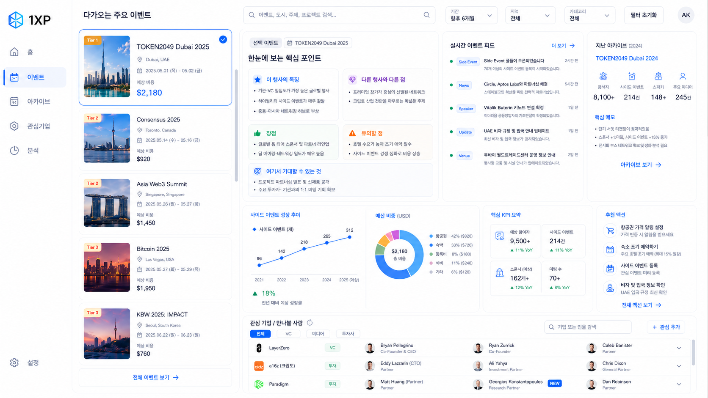

# Event Intelligence Dashboard - Agent Handoff v2

## 1. 프로젝트 목적
다가오는 크립토 이벤트를 보면서, 작년 동일 이벤트의 아카이브와 함께 비교해 **참여 여부를 판단**할 수 있는 데스크탑 중심 대시보드를 만든다.

이 제품은 단순 이벤트 캘린더가 아니라 아래를 판단하는 **의사결정 지원 대시보드**다.
- 이 행사에 갈 가치가 있는가
- 왜 가야 하는가 / 왜 애매한가
- 얼마가 들 것으로 보이는가
- 어떤 기업/사람을 만나야 하는가
- 작년 대비 올해 결이 어떻게 달라졌는가

---

## 2. 선택된 UI 방향
현재 선택된 디자인 방향은 아래 이미지다.



### 핵심 방향
- **화이트 모드**
- 여행/출장 planning 사이트처럼 **눈의 흐름이 직관적**이어야 함
- **왼쪽은 upcoming 이벤트 탐색 리스트**, **오른쪽은 선택된 이벤트의 상세 작업 영역**으로 명확히 구분
- 정보가 많아도 **과밀하게 보이지 않게** 여백과 그룹화를 잘 사용
- 이미지는 **스캔에 도움이 될 때만** 사용
- 1XP 로고를 **좌측 상단**에 배치

---

## 3. 레이아웃 원칙

### 좌측
- **스크롤 가능한 upcoming 이벤트 리스트**
- 각 이벤트 카드는 compact card
- 썸네일, Tier badge, 이름, 도시, 날짜, 예상비용 정도만 빠르게 보이게
- 선택된 이벤트 카드는 강조 표시

### 우측
- 선택된 이벤트의 상세 정보 영역
- 단, 좌측 리스트에 이미 있는 정보(큰 제목, 같은 대표 이미지 반복)는 과하게 반복하지 않음
- 우측 상단의 핵심 영역은 단순 메타정보보다 **이벤트의 특징/차별점/장단점/기대 포인트**를 빠르게 이해하게 해주는 영역이어야 함

### 하단
- 차트/KPI/추천 액션/관심 기업 섹션
- 관심 기업 섹션도 **내부 스크롤 가능**해야 함

---

## 4. 현재 선택된 상세 페이지 구조

### 4.1 좌측 upcoming 리스트
각 카드에 포함
- 이벤트명
- 도시
- 날짜
- 예상비용 (USD)
- Tier badge
- 선택 상태
- 작은 썸네일

### 4.2 우측 상단 핵심 요약 패널
좌측 리스트에 이미 보이는 정보 반복 대신, 다음을 요약한다.

패널 예시 제목:
- `한눈에 보는 핵심 포인트`
- `이 행사의 핵심 요약`

포함 섹션:
1. **이 행사의 특징**
2. **다른 행사와 다른 점**
3. **장점**
4. **유의할 점**
5. **여기서 기대할 수 있는 것**

각 항목은 2~3개의 짧은 bullet로, 한눈에 스캔 가능해야 한다.

### 4.3 실시간 이벤트 피드
우측 상단에 선택된 이벤트 기준 피드 카드 배치
예시 항목:
- side event 등록 오픈
- 스폰서 추가
- 연사 확정
- 비자/입국 규정 업데이트
- venue 운영 정보 업데이트

### 4.3.1 사이드 이벤트 리서치 필수 규칙
이벤트를 추가하거나 업데이트할 때는 사이드 이벤트를 반드시 교차 검증한다.

1. 공식 홈페이지에서 side events / community events / agenda / schedule 페이지 확인
2. Luma Crypto 허브(`https://luma.com/crypto`)와 행사별 Luma 캘린더 확인
3. 웹 검색으로 공식 홈페이지와 Luma에 없는 이벤트 보완

세부 절차와 병합 규칙은 `docs/side-events-workflow.md`를 따른다.

### 4.4 지난 아카이브 카드
작년 동일 이벤트 1개만 기본 노출
포함 항목:
- 참석자 수
- 사이드 이벤트 수
- 스폰서 수
- 주요 연사/미디어 수
- 핵심 메모
- 아카이브 보기 링크

---

## 5. 비용 표시 규칙

### 카드/상세 화면 기본 노출
- **총 예상비용만** 보여준다
- USD 고정
- 기본은 단일 추정값

예:
- `$2,180`

### hover / click tooltip
상세 비용은 tooltip/popover에서만 제공

포함 항목:
- ICN 출발 왕복 항공권
- 행사 호텔 (venue 호텔 기준)
- 현지 교통비
- 식비(예상)
- 티켓 비용
- 총 예상비용

### 비용 규칙
- 출발지: **ICN 고정**
- 좌석 기본값: **이코노미**
- 옵션: **비즈니스 전환 가능**
- 숙박: 행사 시작 **2일 전 도착**, 행사 종료 **1일 후 귀가**
- 숙박 박수 = **행사 일수 + 2박**
- 숙박비는 **venue 호텔 할인 가격 우선**
- venue 할인 가격이 없으면 **유사 Tier / 유사 지역 행사 venue 할인 패턴 기반으로 추정**
- 식비는 **도시 평균 식비 기반 추정**
- 티켓은 **가장 일반적인 메인 입장권 기준**
- VIP / premium / business pass는 기본 합산에서 제외
- 별도 기관용 1일권이 있으면 note만 표시
- 티켓 미공개면 **작년 가격 기반 추정** + `자료 부족 추정` 표기

---

## 6. Tier 규칙
- Tier는 기본적으로 **자동 계산**
- 필요하면 **수동 override 가능**
- 배지는 카드의 **좌상단 border에 겹치는 작은 형태**
- 리스트 카드와 상세 카드 모두 동일 원칙
- 최종 Tier와 자동 계산 Tier는 함께 볼 수 있어야 함
- hover 시 점수 근거 노출 가능

---

## 7. 차트 / KPI
현재 선택 방향에서는 아래 정도가 적절함.
- 사이드 이벤트 성장 추이
- 예산 비중 차트 또는 비용 구성 시각화
- 핵심 KPI 요약
- 추천 액션

주의:
- 차트는 많더라도 **한 번에 3~4개 묶음 정도**로 제한
- 거래 터미널처럼 보이지 않고, 출장 판단 화면처럼 보여야 함

---

## 8. 관심 기업 / 만나볼 사람
- 하단에 별도 섹션
- **내부 스크롤 가능**
- 후보/선택 구조를 명확히 유지
- 기업 중심으로 보여주고, 사람은 inline 또는 확장 행으로 표시
- 새로 추가된 후보는 `NEW` 배지

### 구조
- 기업명
- 태그(VC / 투자 / 미디어 / 후원사 등)
- 주요 인물들
- 역할
- 확장/접기

---

## 9. 업데이트 주기
이벤트 시작일까지 남은 기간 기준:

- 30일 초과: 7일마다 1회
- 30일 이하, 14일 초과: 3일마다 1회
- 14일 이하부터 행사 시작 전까지: 1일 1회
- 행사 시작일부터 종료 전까지: 3시간마다 1회
- 행사 종료 후: final snapshot 1회 생성 후 archive로 반영

업데이트 대상:
- side event 수
- 스폰서 수
- 연사 수
- 공개 참석자
- 추천 후보
- 비용 근거
- 티켓 정보
- 아카이브 비교 신호

---

## 10. 구현상 중요한 UX 메모
- 좌측 리스트는 **명확히 탐색 영역**처럼 보여야 함
- 우측은 **선택한 이벤트의 작업 공간**처럼 보여야 함
- 같은 대표 이미지/같은 큰 제목을 좌우에서 반복하지 않음
- 우측 상단은 메타정보보다 **핵심 특징 요약**이 먼저 와야 함
- 이미지가 없다면 굳이 넣지 않음
- 관심 기업 섹션은 반드시 스크롤 가능한 느낌을 줘야 함
- 전반적으로 정보는 많아도 **스캔 가능성**이 가장 중요함

---

## 11. 구현 우선순위
1. 좌측 리스트 + 우측 상세 2-column 구조 고정
2. 핵심 요약 패널 / 실시간 피드 / 아카이브 카드 배치
3. 비용 tooltip / tier badge / scrollable sections 구현
4. 차트/KPI/추천 액션 구현
5. 관심 기업 섹션 + 내부 스크롤 + NEW badge 구현
6. 실제 데이터 연결

---

## 12. 에이전트 전달용 짧은 요약
```text
화이트 모드의 desktop-first crypto event intelligence dashboard를 구현한다. 핵심은 좌측은 스크롤 가능한 upcoming 이벤트 리스트, 우측은 선택된 이벤트의 상세 작업 영역으로 명확히 나뉘는 구조다. 선택된 이벤트 상세 화면에서는 좌측에서 이미 보이는 큰 제목/대표 이미지/기본 메타정보를 과하게 반복하지 않고, 대신 상단 핵심 요약 패널에서 이 이벤트의 특징, 다른 행사와 다른 점, 장점, 유의할 점, 여기서 기대할 수 있는 것을 짧은 bullet로 스캔 가능하게 보여준다. 실시간 이벤트 피드, 지난 아카이브 카드, 사이드 이벤트 성장 추이, 예산 비중, KPI 요약, 추천 액션, 관심 기업/만나볼 사람 섹션을 포함한다. 비용은 총 예상비용만 작게 노출하고 hover/click tooltip에서 ICN 항공권, venue 호텔, 현지 교통, 식비, 티켓, 총합을 보여준다. 좌측 이벤트 리스트와 하단 관심 기업 섹션은 모두 스크롤 가능한 구조여야 한다.
```
